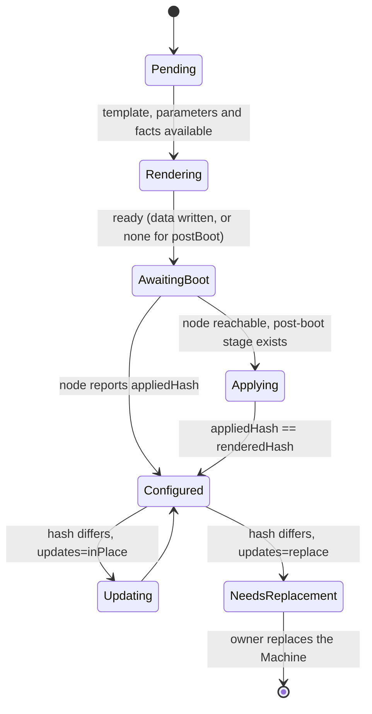
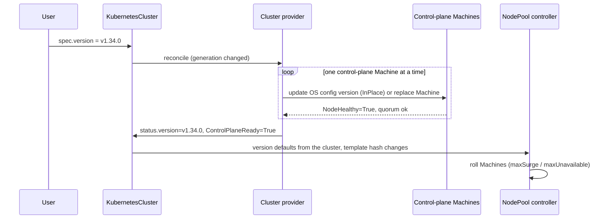

# Proposal: Kubernetes-native API for KubernetesCluster and Machine

| | |
|---|---|
| **Status** | Draft / for discussion |
| **Affects** | `common` (CRDs), all cluster, machine and OS providers |
| **Date** | 2026-10-05 |
| **Migration** | [migration-talos.md](migration-talos.md): current situation and steps from today's implementation |
| **Code mapping** | [code-mapping.md](code-mapping.md): proposal vs. current code, hard-to-migrate parts and gaps |
| **Future** | [physical-machines.md](physical-machines.md): how physical machines fit this model (not in initial scope) |

## 1. Summary

A first-principles design for vitistack's cluster and machine APIs, following patterns Kubernetes already uses for pluggable implementations:

- **Classes select implementations**, as in Gateway API (`GatewayClass`) and storage (`StorageClass`).
- **Templates roll out immutable instances**, as Deployment does with Pods.
- **Generic objects reference provider-specific objects**, as Cluster API does.

It deliberately ignores how things are implemented today. Migration is a separate concern, described in [migration-talos.md](migration-talos.md).

## 2. Principles

| # | Principle | Consequence |
|---|---|---|
| 1 | A generic object is implemented by the provider its **class** selects | That provider is the single owner of the object's status |
| 2 | **Spec is intent, status is observation** | Users and parent controllers write spec; owning controllers write status; `observedGeneration` + `metav1.Condition` |
| 3 | **No commands in annotations** | Upgrades are spec changes; one-off actions are separate objects |
| 4 | **Composition by reference, cleanup by ownership** | `ownerReferences` for garbage collection; one finalizer per party for ordered cleanup |
| 5 | **Templates + immutable instances** | Changing a template rolls out new instances; in-place update is opt-in |
| 6 | **Event-driven** | Watch dependencies; `RequeueAfter` only for systems that can't be watched |
| 7 | **Secrets only for secrets** | Standard names; no progress state |

## 3. Object model

```mermaid
flowchart TD
  KCC[KubernetesClusterClass<br/>cluster-scoped] 
  MC[MachineClass<br/>cluster-scoped]
  KC[KubernetesCluster] -->|className| KCC
  NP[NodePool<br/>/scale] -->|clusterName| KC
  KC -. generates from spec.workers.pools .-> NP
  KC -. owns control-plane Machines .-> M
  NP -->|owns| M[Machine<br/>mostly immutable]
  M -->|className| MC
  MC -->|machineProviderRef| MP[MachineProvider<br/>registration, cluster-scoped]
  KCC -->|kubernetesProviderRef| KP[KubernetesProvider<br/>registration, cluster-scoped]
  M -->|bootstrap.configRef| OSC[OS config<br/>e.g. TalosMachineConfig]
  KCC -->|parametersRef| TCC[Provider parameters<br/>e.g. TalosClusterConfig]
  KCC -. default .-> OST[OS config template<br/>e.g. TalosMachineConfigTemplate]
  KC -. override .-> OST
  NP -. override .-> OST
  OST -->|instantiated per Machine| OSC
  KC -->|owns| S[(Secrets)]
```

| Object | Scope | Generic? | Reconciled by | Selected through |
|---|---|---|---|---|
| `KubernetesClusterClass` | Cluster | Yes | — (admin config) | — |
| `KubernetesCluster` | Namespace | Yes | Cluster provider | `class.controllerName` |
| `KubernetesCluster.spec.workers.pools` | — | Yes | **Generic** topology controller (generates NodePools, §4.4) | — |
| Control-plane Machines | Namespace | Yes | Cluster provider | Owned by the cluster |
| `NodePool` | Namespace | Yes | **Generic** node-pool controller | — |
| `MachineClass` | Cluster | Yes | — (admin config) | — |
| `KubernetesProvider` / `MachineProvider` | Cluster | Yes | Registered by the provider operator | Referenced by classes (§3.1) |
| `Machine` | Namespace | Yes | Machine provider | `class.controllerName` |
| OS config template (`TalosMachineConfigTemplate`, …) | Namespace | No | — (read when creating Machines) | Class default, overridable (§6.1) |
| OS config (`TalosMachineConfig`, …) | Namespace | No | OS provider | Its kind |
| Provider parameters (`TalosClusterConfig`, …) | Either | No | Read by the provider | `parametersRef` |

**Why the control plane stays with the cluster provider:** its ordering is provider-specific (etcd quorum, bootstrapping the first node). Worker pools need no provider-specific logic to scale, so one generic controller manages them.

### 3.1 Provider registrations

`KubernetesProvider` and `MachineProvider` are kept. They are **metadata registrations**: each provider operator creates and updates them to describe what it offers in this datacenter (type, region, zones, capabilities, backend), and they are sent upstream to the management system to visualise available capabilities.

| | Registration (`KubernetesProvider`, `MachineProvider`) | Class (`KubernetesClusterClass`, `MachineClass`) |
|---|---|---|
| Written by | Provider operator | Platform admin |
| Describes | What *exists* (capabilities, backend) | What users can *request* (defaults, sizes, parameters) |
| Used for | Upstream visualisation, linking | Selecting implementation and defaults |

Rules:

- Each class references exactly one registration (`kubernetesProviderRef`, `machineProviderRef`).
- The registration's `providerType` must match the implementation behind the class's `controllerName`; otherwise the class reports `Accepted=False, reason=ProviderMismatch`.
- A missing or disabled registration makes the class `Accepted=False, reason=ProviderNotAvailable`; objects using the class wait.
- Registrations are never written by users and carry no desired state for clusters or machines.

## 4. Cluster resources

### 4.1 `KubernetesClusterClass`

Set up by platform admins. Decides which controller implements a cluster, which default parameters apply, and which OS config templates machines get by default.

```yaml
apiVersion: vitistack.io/v1alpha1
kind: KubernetesClusterClass
metadata: { name: talos-standard }
spec:
  controllerName: talos.vitistack.io/cluster-controller
  kubernetesProviderRef: { name: talos-operator }       # registration (§3.1)
  parametersRef: { group: talos.vitistack.io, kind: TalosClusterConfig, name: standard, namespace: platform }
  machineConfig:
    allowedKinds:                           # OS config kinds this cluster provider supports
      - { group: talos.vitistack.io, kind: TalosMachineConfigTemplate }
    controlPlane:
      templateRef: { group: talos.vitistack.io, kind: TalosMachineConfigTemplate, name: standard-cp, namespace: platform }
    workers:
      templateRef: { group: talos.vitistack.io, kind: TalosMachineConfigTemplate, name: standard-worker, namespace: platform }
status:
  conditions: [{ type: Accepted, status: "True" }]
```

### 4.2 `KubernetesCluster`

What users write. Contains nothing provider-specific.

```yaml
apiVersion: vitistack.io/v1alpha1
kind: KubernetesCluster
metadata: { name: prod-a, namespace: tenant-a }
spec:
  className: talos-standard                 # immutable
  version: v1.33.2                          # changing it = upgrade
  paused: false
  controlPlane:
    replicas: 3                             # odd, 1..7
    machineClassName: large
    machineConfig:                          # optional: overrides class controlPlane default
      templateRef: { group: talos.vitistack.io, kind: TalosMachineConfigTemplate, name: prod-a-cp }
  workers:
    machineConfig:                          # optional: overrides class workers default for all pools
      templateRef: { group: talos.vitistack.io, kind: TalosMachineConfigTemplate, name: prod-a-worker }
    pools:                                  # optional: generates NodePools (§4.4)
      - name: general
        machineClassName: medium
        replicas: 3                         # fixed size: the cluster owns replicas
      - name: gpu
        machineClassName: gpu-xlarge
        autoscaling: { minReplicas: 1, maxReplicas: 10 }   # autoscaled: the NodePool owns replicas
        machineConfig:
          templateRef: { group: talos.vitistack.io, kind: TalosMachineConfigTemplate, name: gpu }
        taints: [{ key: gpu, effect: NoSchedule }]
  network:
    networkNamespaceName: tenant-a-net
    pods: 10.244.0.0/16
    services: 10.96.0.0/12
  parametersRef:                            # optional per-cluster override
    kind: TalosClusterConfig
    name: prod-a
status:
  observedGeneration: 12
  version: v1.33.2                          # lowest version on the control plane
  endpoint: { host: 10.0.0.10, port: 6443 }
  kubeconfigSecretRef: { name: prod-a-kubeconfig }
  controlPlane:
    replicas: 3
    readyReplicas: 3
    updatedReplicas: 3
    machineConfigTemplateRef:               # resolved value actually in use
      { group: talos.vitistack.io, kind: TalosMachineConfigTemplate, name: prod-a-cp, namespace: tenant-a }
  workers:                                  # written by the topology controller
    pools:                                  # generated and standalone pools for this cluster
      - { name: general,   nodePool: prod-a-general, replicas: 3, readyReplicas: 3, scalingMode: Fixed }
      - { name: gpu,       nodePool: prod-a-gpu,     replicas: 6, readyReplicas: 6, scalingMode: Autoscaled, minReplicas: 1, maxReplicas: 10 }
      - { name: batch,     nodePool: batch-team-x,   replicas: 2, readyReplicas: 2, scalingMode: Standalone }
  conditions:
    - { type: Accepted,          status: "True" }
    - { type: EndpointReady,     status: "True" }
    - { type: ControlPlaneReady, status: "True" }
    - { type: Upgrading,         status: "False" }
    - { type: Ready,             status: "True" }
```

Notes:

- **No `phase`.** Kubernetes API conventions prefer conditions. Use a `Ready` printer column for `kubectl get`.
- **Worker pools** are either declared inline in `spec.workers.pools` (generated NodePools, §4.4) or created as standalone `NodePool` objects (§4.3). Both can be used in the same cluster.
- **Two status writers.** The cluster provider owns `status` except `status.workers`, which the topology controller owns. Both use server-side apply with their own field manager.

### 4.3 `NodePool`

Works like a Deployment for Machines. A NodePool is either **standalone** (created by a user) or **generated** from `KubernetesCluster.spec.workers.pools` (§4.4). Both are reconciled by the same controller.

```yaml
apiVersion: vitistack.io/v1alpha1
kind: NodePool
metadata: { name: prod-a-gpu, namespace: tenant-a }
spec:
  clusterName: prod-a
  replicas: 4                               # owner depends on mode (§4.4.2)
  autoscaling: { minReplicas: 1, maxReplicas: 10 }   # optional; bounds for the autoscaler
  selector: { matchLabels: { vitistack.io/nodepool: prod-a-gpu } }
  template:                                 # MachineTemplateSpec, not a Machine spec
    metadata: { labels: { vitistack.io/nodepool: prod-a-gpu } }
    spec:
      className: gpu-xlarge
      version: v1.33.2                      # defaults from the cluster
      machineConfig:                        # optional: overrides cluster and class defaults
        templateRef: { group: talos.vitistack.io, kind: TalosMachineConfigTemplate, name: gpu }
      taints: [{ key: gpu, effect: NoSchedule }]
  strategy:
    type: RollingUpdate                     # RollingUpdate (replace) | InPlace
    rollingUpdate: { maxSurge: 1, maxUnavailable: 0 }
status:
  observedGeneration: 3
  replicas: 4
  readyReplicas: 4
  updatedReplicas: 4
  selector: vitistack.io/nodepool=prod-a-gpu
  machineConfigTemplateRef:                 # resolved value actually in use
    { group: talos.vitistack.io, kind: TalosMachineConfigTemplate, name: gpu, namespace: tenant-a }
  conditions: [{ type: Ready, status: "True" }]
```

`spec.template` is a **`MachineTemplateSpec`**: it holds what Machines are created *from* (`machineConfig.templateRef`). The created `Machine.spec` holds what each Machine *uses* (`bootstrap.configRef` to its own OS config object). The two types differ on purpose.

Why separate from the cluster:

- a `/scale` subresource, so autoscalers and `kubectl scale` work
- its own RBAC and its own rollout per pool
- changing one pool doesn't conflict with changes to the whole cluster

The generic controller resolves the OS config template (§6.1), hashes the template together with the resolved OS config template (like `pod-template-hash`), creates a Machine and an OS config object from it, and rolls them according to `strategy`. `InPlace` is only allowed if the OS provider declares `updates: inPlace` (§6.4).

### 4.4 Pools declared in the cluster (managed topology)

Users can describe the whole cluster in one object. A generic **topology controller** turns each entry in `KubernetesCluster.spec.workers.pools` into a `NodePool`. The generated NodePools keep everything a separate object gives: `/scale`, per-pool status and per-pool rollout.

The model is Deployment → ReplicaSet: the parent generates and owns the child, the child does the work, and nothing is copied from the child back into the parent's spec.

#### 4.4.1 Generation

| Aspect | Rule |
|---|---|
| Name | `<cluster>-<pool>`; reserved, so the topology controller never adopts an object it did not create |
| Ownership | `ownerReferences` → `KubernetesCluster`; removing a pool from the spec deletes the NodePool, and its Machines are drained through the normal finalizers |
| Labels | `vitistack.io/managed-by: cluster`, `vitistack.io/replicas-owner: cluster \| nodepool` |
| Writes | Server-side apply with field manager `vitistack-topology` |
| Fields owned by the cluster | Everything copied from the pool entry: machine class, version, `machineConfig`, taints, labels, strategy, `autoscaling` bounds, and `replicas` when set (§4.4.2) |
| Direct edits | Edits to cluster-owned fields of a generated NodePool are rejected by admission policy ("edit the KubernetesCluster instead") |

#### 4.4.2 Replicas and autoscaling

Each pool entry sets **exactly one** of `replicas` or `autoscaling`:

```yaml
# CEL on each entry in spec.workers.pools
- rule: "has(self.replicas) != has(self.autoscaling)"
  message: "set either replicas or autoscaling, not both"
- rule: "!has(self.autoscaling) || self.autoscaling.minReplicas <= self.autoscaling.maxReplicas"
- rule: "!has(self.autoscaling) || self.autoscaling.minReplicas >= 0"
```

| Pool entry | Owner of `NodePool.spec.replicas` | Initial size | `/scale` on the NodePool |
|---|---|---|---|
| `replicas: N` (`Fixed`) | Cluster (topology controller) | N | Rejected; change the cluster spec instead |
| `autoscaling: {min, max}` (`Autoscaled`) | NodePool (autoscaler or user) | `min` | Accepted within `[min, max]`, rejected outside |

- **No write-back.** Scaling a NodePool never changes `KubernetesCluster.spec`. Actual sizes are reported in `KubernetesCluster.status.workers.pools`.
- **No `defaultReplicas`.** A value used only at creation would ignore later edits, which isn't declarative. The initial size is `minReplicas`; to start larger, scale the NodePool once. If a larger start is a frequent need, add an immutable `autoscaling.initialReplicas`.
- **The cluster can't have its own `/scale`.** A CRD's scale subresource maps to one replicas field, and a cluster has several pools. That's why pools must be real objects to be autoscaled.

#### 4.4.3 Enforcement

| Rule | Mechanism |
|---|---|
| `/scale` rejected on `Fixed` pools | `ValidatingAdmissionPolicy` matching `nodepools/scale` and `nodepools`: reject changes to `spec.replicas` when `replicas-owner: cluster`, unless the request comes from the topology controller's service account |
| `/scale` within bounds on `Autoscaled` pools | Same policy: reject values outside `spec.autoscaling` |
| Bounds changed and current size is outside them | Topology controller clamps the size into the new range through `/scale` under its own field manager. Cluster-autoscaler does not, by default, scale a node group up to its minimum unless pods are pending |

#### 4.4.4 Switching mode

| Change | Steps |
|---|---|
| `replicas` → `autoscaling` | 1. Write the current value through `/scale` under a separate field manager, so `vitistack-topology` is no longer the only owner. 2. Drop `replicas` from the applied config and set `replicas-owner: nodepool`. 3. Clamp into the bounds. Without step 1, server-side apply would remove the field and reset the pool to its default size. |
| `autoscaling` → `replicas` | Apply with `force` to take ownership, set `replicas-owner: cluster`; the pool scales to `replicas` and rolls out normally |

#### 4.4.5 Standalone NodePools

- Always own their `replicas` (`scalingMode: Standalone` in cluster status).
- Found through `spec.clusterName` and listed in `KubernetesCluster.status.workers.pools`.
- May not use a name reserved for a generated pool (`<cluster>-<pool>` for any pool in the spec).

#### 4.4.6 Edge cases

| Case | Behaviour |
|---|---|
| Pool removed from the cluster spec | Generated NodePool deleted; Machines drained through finalizers |
| GitOps manages the cluster and an autoscaler scales a pool | No conflict: `replicas` is not in the cluster spec for `Autoscaled` pools |
| Pool renamed in the cluster spec | Treated as remove + add: a new NodePool is created and the old one is deleted |
| Cluster deleted | Generated NodePools are garbage-collected; standalone NodePools report `Ready=False, reason=ClusterNotFound` |

## 5. Machine resources

### 5.1 `MachineClass`

```yaml
apiVersion: vitistack.io/v1alpha1
kind: MachineClass
metadata: { name: gpu-xlarge }
spec:
  controllerName: kubevirt.vitistack.io/machine-controller
  machineProviderRef: { name: kubevirt-prod-1 }         # registration (§3.1): which backend
  resources: { cpu: 16, memory: 64Gi }
  parametersRef: { kind: KubevirtMachineParameters, name: gpu }
```

The class combines **what** (size, parameters) with **where** (`machineProviderRef`: the registered backend, e.g. one KubeVirt cluster). The same size on another backend is another class.

### 5.2 `Machine`

Treated like a Pod: mostly immutable, replaced rather than edited.

```yaml
apiVersion: vitistack.io/v1alpha1
kind: Machine
metadata:
  name: prod-a-gpu-7f9c-x2k4
  labels: { vitistack.io/cluster: prod-a, vitistack.io/nodepool: prod-a-gpu, vitistack.io/role: worker }
  ownerReferences: [{ kind: NodePool, name: prod-a-gpu, controller: true }]
  finalizers:
    - kubevirt.vitistack.io/machine          # machine provider: delete VM
    - talos.vitistack.io/node-cleanup        # cluster provider: drain, etcd, VIP
spec:                                        # immutable except providerID
  clusterName: prod-a                        # optional
  className: gpu-xlarge
  version: v1.33.2
  bootstrap:
    configRef: { kind: TalosMachineConfig, name: prod-a-gpu-7f9c-x2k4 }
  providerID: ""                             # set once by the machine provider
status:
  observedGeneration: 1
  addresses:
    - { type: InternalIP, address: 10.0.0.31 }
    - { type: Hostname,   address: prod-a-gpu-7f9c-x2k4 }
  nodeRef: { name: prod-a-gpu-7f9c-x2k4 }
  hardware:
    interfaces: [{ name: eth0, mac: 52:54:00:12:34:56 }]
    disks: [{ path: /dev/vda, serial: abc123, sizeBytes: 107374182400 }]
  conditions:
    - { type: InfrastructureReady, status: "True" }   # machine provider
    - { type: BootstrapReady,      status: "True" }   # OS provider
    - { type: OSConfigured,        status: "True" }   # OS provider
    - { type: NodeHealthy,         status: "True" }   # cluster provider
    - { type: Ready,               status: "True" }   # machine provider computes from the above
```

#### Several writers on `Machine.status`

Allowed, under one rule: **each writer uses server-side apply with its own field manager and owns distinct condition types.** No writer replaces the whole status. Pods work this way (readiness gates).

| Writer | Owns |
|---|---|
| Machine provider | `addresses`, `hardware`, `providerID`, `InfrastructureReady`, `Ready` |
| OS provider | `BootstrapReady`, `OSConfigured` |
| Cluster provider | `nodeRef`, `NodeHealthy` |

#### Deletion order via finalizers

Each party removes only its own finalizer. One rule gives the correct order:

> The machine provider deletes the VM or host only when its finalizer is the last one left.

This handles drain, etcd membership and VIP removal before infrastructure is deleted, without special scale-down code paths.

### 5.3 Physical machines (future)

Physical machines fit this model without changes to `Machine`, `NodePool` or `KubernetesCluster`: a bare-metal machine provider claims a pre-registered `PhysicalHost` (the PersistentVolume / PersistentVolumeClaim pattern). Not in initial scope; see [physical-machines.md](physical-machines.md).

## 6. OS configuration

The machine provider boots machines; the OS provider decides what runs on them.

- An **OS config template** (e.g. `TalosMachineConfigTemplate`) is resolved per control plane or node pool (§6.1).
- The controller that creates the Machine (cluster provider for control plane, NodePool controller for workers) creates one OS config object per Machine (`TalosMachineConfig`) from that template and sets `Machine.spec.bootstrap.configRef`.

### 6.1 Resolving the OS config template

Configurable on the class, overridable on the cluster and on the node pool. **The most specific level wins.**

| Machines | 1st (most specific) | 2nd | 3rd (default) |
|---|---|---|---|
| Control plane | `KubernetesCluster.spec.controlPlane.machineConfig.templateRef` | — | `KubernetesClusterClass.spec.machineConfig.controlPlane.templateRef` |
| Workers in a pool | `NodePool.spec.template.spec.machineConfig.templateRef` | `KubernetesCluster.spec.workers.machineConfig.templateRef` | `KubernetesClusterClass.spec.machineConfig.workers.templateRef` |

For a generated NodePool, the pool-level value comes from `KubernetesCluster.spec.workers.pools[].machineConfig.templateRef`; the topology controller copies it into the NodePool template.

Rules:

1. **Override replaces, it does not merge.** A reference at a more specific level replaces the whole template reference. Combining settings (e.g. cluster-wide patches plus pool-specific patches) is the OS provider's job inside its own template and parameters, not the generic resolver's.
2. **Allowed kinds.** Every resolved reference must match `class.spec.machineConfig.allowedKinds`. Otherwise the owner of the object sets `Accepted=False, reason=UnsupportedMachineConfigKind` and creates no Machines.
3. **Namespaces.** Class references may point to any namespace (the class is cluster-scoped and admin-owned). Cluster and node-pool references are resolved in their **own namespace** only.
4. **No resolved template is an error.** If no level provides a reference, the owner sets `Accepted=False, reason=NoMachineConfigTemplate`.
5. **Visible result.** The resolved reference is written to status (`KubernetesCluster.status.controlPlane.machineConfigTemplateRef`, `NodePool.status.machineConfigTemplateRef`).
6. **Changes roll out.** A change at any level that alters the resolved reference, or a change to the referenced template's `generation`, changes the template hash and rolls Machines according to the pool's `strategy` (control plane: the cluster provider's rollout). Controllers watch class, cluster and template objects so this is event-driven.

### 6.2 Status fields every OS config object must expose

Generic readers (the machine provider, tooling) read these fields without knowing the concrete type:

| Field | Meaning |
|---|---|
| `status.ready` | Bootstrap step finished; the machine may boot |
| `status.dataSecretName` | Secret with data to deliver before boot; empty when the OS is configured only after boot |
| `status.dataFormat` | Format of that data (`nocloud`, `configDrive`, `ignition`, `kernelArgsURL`, …) |
| `status.image` | Boot or installer image matching the desired OS version |
| `status.lifecycle` | What this OS provider does for this machine (§6.4): `{ initial, updates }` |
| `status.renderedHash` | Hash of the desired config |
| `status.appliedHash` | Hash of what the node reports |
| `status.conditions` | Details, including `RequiresReplacement` (§6.4) |

The OS provider also sets `BootstrapReady` and `OSConfigured` on the Machine.

### 6.3 Rules

- The machine provider boots only after `BootstrapReady=True`, using `status.image`, and `status.dataSecretName` in `status.dataFormat` when set. Ready with an empty `dataSecretName` means *boot without data* (configuration happens after boot).
- If the machine provider can't deliver `status.dataFormat`, it sets `InfrastructureReady=False, reason=UnsupportedBootstrapFormat` and doesn't boot.
- **The boot image comes from the OS provider**, not from `Machine.spec`. One source of truth.
- In-place updates happen in the OS config object. `Machine.spec` stays immutable.

### 6.4 Lifecycle

Operating systems differ in *when* they can receive configuration:

| Need | Example |
|---|---|
| **Initial config** before boot | Talos nocloud, Ignition, cloud-init |
| **Initial config** after boot | Talos maintenance mode, Windows WinRM, Ansible |
| **Day-2 changes** | Talos `apply-config` / `upgrade`, an agent, or replacing the machine |

The OS provider decides this from its own template and parameters, and **declares it in `status.lifecycle`** so generic controllers can act on it:

| Field | Values | Meaning |
|---|---|---|
| `initial` | `preBoot` \| `postBoot` \| `preBootThenPostBoot` | How the first configuration reaches the node |
| `updates` | `inPlace` \| `replace` \| `none` | How a changed `renderedHash` reaches a running node |

| OS | `initial` | `updates` |
|---|---|---|
| Talos on VM | `preBoot` | `inPlace` |
| Talos on physical machines | `preBoot` or `postBoot` (maintenance mode) | `inPlace` |
| Flatcar / Fedora CoreOS (Ignition) | `preBoot` | `replace` |
| Ubuntu / RHEL + kubeadm | `preBootThenPostBoot` | `inPlace` or `replace` |
| Windows | `preBootThenPostBoot` | `inPlace` |

Consequences:

- **`strategy: InPlace`** on a NodePool (or the control plane) requires `updates: inPlace`; otherwise the NodePool sets `Accepted=False, reason=InPlaceNotSupported`.
- **`updates: replace`**: when `renderedHash` changes, the OS provider sets `RequiresReplacement=True`. The owner of the Machine (NodePool controller or cluster provider) replaces it in its normal rollout order.
- **Hardware facts** come from `Machine.status.hardware`, filled by the machine provider (for physical machines: from inspection when the host is registered). Facts discovered inside the guest are an open question (§13).

State machine of an OS config object:



The OS provider moves **one machine** through these states. It never decides ordering across machines; the owner of the Machines does (pool `strategy` in §4.3, control-plane rollout in §10).

### 6.5 Delivering configuration after boot

| Model | How | Trade-off |
|---|---|---|
| **Push** | The OS provider calls the node (Talos gRPC, SSH, WinRM) | Simple; needs network access from the OS provider to every node. Talos only supports this |
| **Pull** | An agent in the guest fetches its config and reports what it applied | Scales better and works across firewalls; needs an agent and a per-node credential |

The contract is the same either way: the OS provider sets `renderedHash`, the node's reported state becomes `appliedHash`.

### 6.6 Security

- **Least access.** The machine provider reads only the per-machine data Secret (`<machine>-bootstrap`), never the cluster secrets.
- **Minimal pre-boot data.** Include only what the OS needs to boot. Talos needs its full machine config, including PKI, so its per-machine Secrets need strict RBAC and should be deleted or emptied once `OSConfigured=True` if the machine provider no longer needs them.
- **Short-lived credentials** (e.g. kubeadm join tokens) carry an expiry in the OS config status. If the machine has not booted in time, the OS provider re-renders and rotates them; the changed hash makes the machine provider deliver the new data.
- **Visibility.** Pre-boot data is often readable from inside the guest (metadata service, config drive). Treat it as readable by anyone with access to the machine.

### 6.7 Why OS-specific objects rather than one generic `MachineOSConfig`

| | One generic CRD with a section per OS | Separate CRD per OS + status contract (chosen) |
|---|---|---|
| Adding an OS | Change and release `common` | No change to `common` |
| External providers | Awkward | Natural |
| Tooling | One type to understand | Reads the agreed fields generically |
| Fits when | The set of OSes is small and owned by vitistack | The set of OSes is open-ended |

## 7. Secrets

Standard names, each with `ownerReference` → `KubernetesCluster`:

| Secret | Content |
|---|---|
| `<cluster>-kubeconfig` | Admin kubeconfig |
| `<cluster>-ca` | Cluster CA |
| `<cluster>-<provider>-secrets` | Provider secrets (e.g. Talos secrets bundle, talosconfig) |
| `<machine>-bootstrap` | Per-machine bootstrap data (from the OS provider) |

No progress flags, timestamps or state. Those belong in status.

## 8. One-off actions

Actions that aren't desired state (reboot, reset, re-apply) are **operation objects**, like a Job:

```yaml
apiVersion: vitistack.io/v1alpha1
kind: MachineOperation
metadata: { name: reboot-x2k4, namespace: tenant-a }
spec:
  machineName: prod-a-gpu-7f9c-x2k4
  type: Reboot              # Reboot | Reset | ReapplyConfig
status:
  conditions: [{ type: Complete, status: "True" }]
```

They are auditable, RBAC-controlled and leave a record. To roll *every* machine in a pool, bump an annotation in the pool template, as `kubectl rollout restart` does.

## 9. Controller behaviour

| Concern | Approach |
|---|---|
| Triggers | `For` the owned kind, `Owns` children, `Watches` referenced objects (class, parameters, OS config, Secrets) mapped back via field indexes |
| Polling | None by default; `RequeueAfter` with backoff only while waiting on systems that can't be watched |
| Workload clusters | Cached client and informer per cluster; **watch Nodes** so readiness arrives as events |
| Errors | Return the error so the rate-limited workqueue backs off; record a condition with reason and message |
| Each pass | Read status → do one step → write status → return; idempotent and level-triggered |
| Status writes | One server-side-apply patch per pass with a field manager; set `observedGeneration` |
| Validation | CEL in the CRD (immutability, ranges, odd control-plane count); cross-object checks as conditions or webhooks |
| Events | Kubernetes Events on condition transitions |
| Pause | `spec.paused` on the cluster, honoured by all child controllers |

## 10. Example: version upgrade



Worker pools are never upgraded past the control-plane version, enforced by a CEL rule or a blocking condition.

## 11. Trade-offs

| Decision | Alternative | When the alternative is better |
|---|---|---|
| Inline pools generating `NodePool` objects, plus standalone NodePools | Only separate NodePools, or only inline pools | Separate only: fewer controllers and no ownership rules. Inline only: autoscaling and per-pool RBAC don't matter |
| `replicas` XOR `autoscaling`, no write-back | Syncing `/scale` back into the cluster spec | Never: two writers on one value cause fights and GitOps drift |
| Generic NodePool controller | Each cluster provider manages pools | Pool rollout really depends on the provider |
| Immutable Machines | Mutable Machines | Replacement is expensive (bare metal); costs provider complexity |
| OS-specific config + status contract | One generic OS CRD | The set of OSes is small and owned by vitistack |
| Several condition writers on `Machine` | A core Machine controller that mirrors conditions | You want a single writer and accept running a core controller |
| Class + `controllerName` | `spec.provider` string | Simplicity matters more than admin defaults and parameters |
| OS config template on class, overridable by cluster and pool (replace semantics) | Merge settings across levels | Layered settings are needed; merge rules are OS-specific, so they belong in the OS provider |

## 12. Relation to Cluster API

This model is close to Cluster API's, plus a class layer in the style of Gateway API.

**Arguments for adopting Cluster API directly**

- Mature generic controllers: Cluster, MachineDeployment, MachineSet, MachineHealthCheck, ClusterClass, a cache of workload-cluster clients, upgrade orchestration, autoscaler integration.
- KubeVirt and Talos providers exist (check how actively they are maintained before relying on them).

**Arguments against**

- It's large and opinionated; its contracts are broader than vitistack may need.
- Vitistack Machines are also used **without** a Kubernetes cluster. Cluster API Machines assume a cluster.
- Vitistack-specific concepts (NetworkNamespace, VIP, IP allocation) need custom providers either way.

**Middle path:** adopt the conventions in this document with vitistack's own types, and keep a later bridge to Cluster API possible.

## 13. Open decisions

| # | Question |
|---|---|
| 1 | ~~Embed node pools or use separate `NodePool` objects?~~ Decided: inline pools generate NodePools; standalone NodePools also allowed (§4.4) |
| 2 | Generic NodePool and topology controllers in `common`, or per cluster provider? |
| 3 | Immutable Machines for all machine providers, including bare metal? |
| 4 | Is the set of OSes closed (one generic CRD) or open (status contract)? |
| 5 | Several writers on `Machine.status`, or a core mirroring controller? |
| 6 | Adopt Cluster API, mirror its conventions, or a hybrid? |
| 7 | Are `MachineOperation` objects needed initially, or can one-off actions wait? |
| 8 | Should a change to a class default roll out to existing clusters automatically, or only to new clusters / on explicit opt-in? |
| 9 | Is an immutable `autoscaling.initialReplicas` needed? |
| 10 | Are facts discovered inside the guest needed, beyond what machine providers report (including physical-host inspection)? |
| 11 | Pull-based configuration for non-Talos OSes: build an agent, or reuse an existing one (e.g. an Ansible/Salt runner)? |
