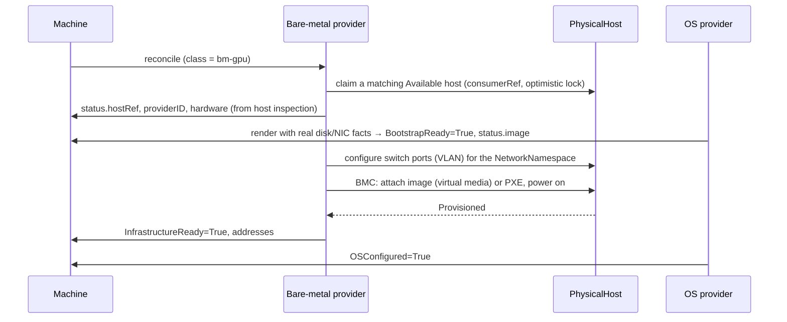

# Discussion: Physical machines (future implementation)

| | |
|---|---|
| **Status** | Discussion / **future implementation**, not part of the initial scope |
| **Builds on** | [kubernetes-native-cluster-machine-api.md](kubernetes-native-cluster-machine-api.md) |
| **Date** | 2026-10-05 |

## 1. Summary

Physical machines fit the main proposal **without changing the generic `KubernetesCluster`, `NodePool` or `Machine` types**. They add an **inventory object** (`PhysicalHost`) and a **claim step**, following the PersistentVolume / PersistentVolumeClaim pattern:

| Storage | Vitistack |
|---|---|
| `PersistentVolume`: exists in advance, admin-managed | `PhysicalHost`: a registered server |
| `PersistentVolumeClaim`: a request | `Machine` |
| `StorageClass`: which provisioner, parameters | `MachineClass`: bare-metal controller, host selector |
| Binding (`claimRef`) | `PhysicalHost.spec.consumerRef` ↔ `Machine.status.hostRef` |
| `reclaimPolicy: Delete/Retain` | `reclaimPolicy: Wipe/Retain` |

Prior art: Metal3 (`BareMetalHost` claimed by `Metal3Machine` through a host selector) and Sidero Metal (`Server` / `ServerClass`, Talos-specific; check its maintenance status before relying on it).

## 2. What differs from VMs

| Aspect | VM | Physical machine | Consequence |
|---|---|---|---|
| Existence | Created on demand | Exists in advance; supply is finite | Inventory plus claim; scaling up can fail |
| Provisioning time | Seconds | Minutes (POST, PXE or virtual media, install) | Event-driven waits; never block a reconcile |
| Hardware facts | Known when the VM is created | Known only after **inspection** | Inspect when the host is registered, before it's claimed |
| Removal | Delete the VM | **Wipe**, power off, return to the pool | Reclaim policy; a cleaning state |
| Replacing a node | Cheap | Expensive; needs a spare host | Rollout strategy and update mode matter |
| Network | Virtual NICs | Switch ports, VLANs, bonding | Inventory includes port mapping |
| Placement | Hypervisor decides | Rack, power and failure domain | Spread or affinity by labels |
| Power control | API | BMC (Redfish / IPMI) | Credentials in a Secret; power state in status |

## 3. `PhysicalHost`

Cluster-scoped and admin-owned. Tenants never see hosts or BMC credentials; they only use MachineClasses.

```yaml
apiVersion: baremetal.vitistack.io/v1alpha1
kind: PhysicalHost
metadata:
  name: rack3-u12
  labels: { vitistack.io/rack: r3, vitistack.io/zone: oslo-a, hardware.vitistack.io/gpu: "a100" }
spec:
  bmc:
    address: redfish+https://10.10.3.12/redfish/v1/Systems/1
    credentialsSecretRef: { name: rack3-u12-bmc, namespace: baremetal-system }
  bootMACAddress: 3c:fd:fe:aa:bb:01
  networkPorts:                         # NIC to switch port, for VLAN configuration
    - { mac: 3c:fd:fe:aa:bb:01, switch: leaf-r3a, port: Ethernet12 }
    - { mac: 3c:fd:fe:aa:bb:02, switch: leaf-r3b, port: Ethernet12 }
  online: true
  consumerRef: null                     # set when a Machine claims the host
  reclaimPolicy: Wipe                   # Wipe | Retain
status:
  state: Available                      # Registering|Inspecting|Available|Provisioning|Provisioned|Deprovisioning|Error
  powerState: Off
  hardware:                             # from inspection
    cpu: { model: EPYC 9354, cores: 64 }
    memoryBytes: 549755813888
    disks: [{ path: /dev/nvme0n1, serial: S6XXXX, sizeBytes: 3840755982336, rotational: false }]
    interfaces: [{ name: enp65s0f0, mac: 3c:fd:fe:aa:bb:01, speedMbps: 25000 }]
  conditions:
    - { type: Inspected,    status: "True" }
    - { type: BMCReachable, status: "True" }
```

**Inspection happens when the host is registered**, not when a Machine is created. Hardware facts therefore exist before any OS config is rendered, so physical machines need no separate discovery step in the OS provider.

## 4. Connecting to the main model

### 4.1 MachineClass

```yaml
apiVersion: vitistack.io/v1alpha1
kind: MachineClass
metadata: { name: bm-gpu }
spec:
  controllerName: baremetal.vitistack.io/machine-controller
  parametersRef: { kind: BareMetalMachineParameters, name: gpu }
---
apiVersion: baremetal.vitistack.io/v1alpha1
kind: BareMetalMachineParameters
metadata: { name: gpu }
spec:
  hostSelector:
    matchLabels: { hardware.vitistack.io/gpu: "a100" }
  bootMethod: virtualMedia              # virtualMedia | pxe
  supportedBootstrapFormats: [nocloud, configDrive, kernelArgsURL]
  reclaimPolicy: Wipe
```

### 4.2 Machine lifecycle



- **Concurrency-safe claim:** `consumerRef` is set with optimistic locking, so two Machines can't claim the same host.
- **OS contract unchanged** (main proposal §6): the OS provider supplies image, bootstrap data and format; the bare-metal provider delivers them through virtual media, PXE, config-drive or a kernel-argument URL (Talos supports `talos.config=<url>` and nocloud).
- **Deletion:** the cluster provider's finalizer drains the node; then the bare-metal provider wipes (if `reclaimPolicy: Wipe`), powers off, clears `consumerRef`, and the host returns to `Available`.

## 5. Consequences for clusters and pools

| Topic | Rule |
|---|---|
| **Out of capacity** | `Machine`: `InfrastructureReady=False, reason=NoAvailableHost`; the NodePool shows replicas waiting. Cluster-autoscaler does not know the inventory, so set `maxReplicas` to what is actually available |
| **Rollout** | `maxSurge` needs free hosts. Usual setting: `maxSurge: 0, maxUnavailable: 1` |
| **Update mode** | Prefer `InPlace` (OS provider updates the running OS). Replacement means wipe plus reinstall: minutes per node |
| **Reusing the same host** | With `maxSurge: 0`, the replacement Machine prefers the host it replaces (`hostAffinity: PreferPrevious`) to keep locality, local storage and cabling |
| **Immutable Machines** | Still possible: the host binding is in status, not spec |
| **Failure domains** | Spread the control plane across racks using host labels (`vitistack.io/rack`, `vitistack.io/zone`) through topology spread in class parameters or the pool template |
| **Networking** | The host's `networkPorts` plus the cluster's NetworkNamespace tell the provider (or a network operator) which VLANs to configure on which switch ports |
| **One-off actions** | `MachineOperation` (Reboot, Reset) maps to a BMC power cycle, or a reset followed by reprovisioning |
| **Mixed clusters** | Control plane on VMs and workers on physical machines, or the reverse: different MachineClasses per control plane and pool. Endpoint and network must be reachable from both |
| **Machines without a cluster** | Work as for VMs: a plain server provisioned with an OS |

## 6. Open questions

| # | Question |
|---|---|
| 1 | Immutable Machines on physical machines: acceptable only with in-place OS updates and `PreferPrevious` host affinity? |
| 2 | Should a class or pool reject `maxReplicas` above the available inventory, or only report it? |
| 3 | Who configures switch ports: the bare-metal provider, or a separate network operator driven by NetworkNamespace? |
| 4 | Bootstrap format negotiation: the OS config exposes `status.dataFormat` (main proposal §6.2–6.3). Should the MachineClass also declare supported formats so a mismatch is rejected before a host is claimed? |
| 5 | Build a vitistack bare-metal provider, or integrate an existing one (Metal3 / Ironic, Tinkerbell)? |
| 6 | Host registration: manual `PhysicalHost` objects, or discovery (e.g. PXE boot into an inspection image that registers itself)? |
